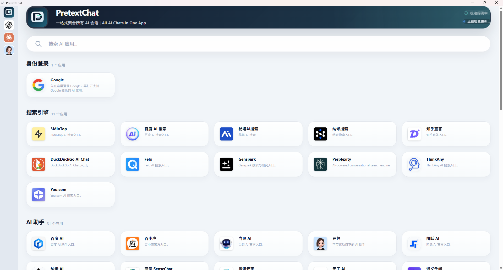
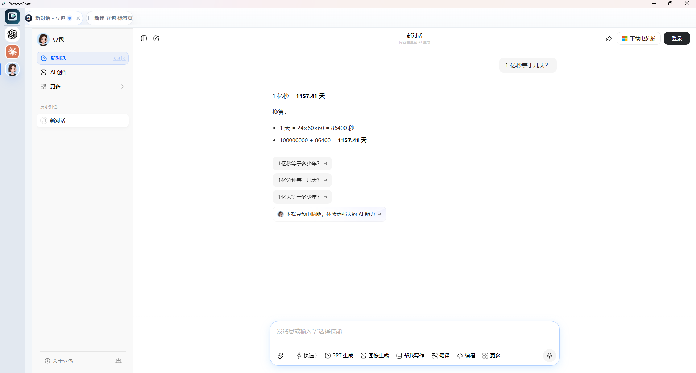

# PretextChat

PretextChat 是一个面向重度 AI 用户的多实例桌面工作客户端。

它不是把 ChatGPT、Claude、Gemini、Perplexity、DeepSeek、Kimi 等 AI 产品继续塞进浏览器标签页里，而是把它们变成可以快速新建、重命名、恢复和切换的任务工作位。




## 产品定位

一句话描述：

> 把混乱的 AI 浏览器标签页，变成结构化的 AI 任务工作区。

PretextChat 适合这样的人：

- 每天同时使用多个 AI 产品
- 同一个 AI 会开多个长期任务
- 经常在“写方案、改代码、查资料、做总结”之间高频切换
- 希望关闭应用后还能快速回到上次工作状态

它不是：

- 通用浏览器
- 模型 API 平台
- 大而全的 AI 聚合市场

## 当前能力

当前版本已经具备：

- 预置 AI 应用目录
- 同一 AI 多开多个独立实例
- 基于标签页的实例切换
- 实例重命名、关闭、最近任务重开
- 会话恢复与登录态保持
- 托盘驻留、再次启动唤起现有窗口
- Windows 安装版检查更新

当前重点仍然是把“AI 工作流”这条主链路打磨清楚，尚未进入平台化阶段。

## 当前内置的 AI 应用

当前内置目录已覆盖主要的全球与中文 AI 产品，包括：

- ChatGPT
- Claude
- Gemini
- Perplexity
- DeepSeek
- Kimi
- 豆包
- 通义千问
- 智谱清言
- 腾讯元宝
- 秘塔 AI 搜索

以及更多开发工具、知识助手和智能体平台入口。完整配置见 [data/ai-apps.json](data/ai-apps.json)。

## 为什么叫 PretextChat

这个项目由 [Pretext](https://github.com/chenglou/pretext) 提供关键能力支持。Pretext 是一个用于多行文本测量与布局的库，可以在不依赖昂贵 DOM reflow 的情况下做更稳定的文本尺寸预测和布局计算。

在 PretextChat 里，Pretext 不是装饰性命名，而是产品方向的一部分。它会持续支撑这些能力：

- 更稳定的 Prompt 输入区域尺寸变化
- 更可预测的长文本布局
- 更少的界面跳动与重排
- 更稳的标签、卡片和分屏文本行为
- 未来聊天列表和工作台布局的虚拟化与估高

> 注：目前该技术尚未实际启用，仅作为架构与命名方向提前定义。

## 本地开发

### 环境要求

- Node.js 22
- npm

### 安装依赖

```bash
npm ci
```

### 启动应用

```bash
npm run start
```

### 类型检查

```bash
npm run lint
```

### 打包发布产物

```bash
# macOS / Linux
npm run make

# Windows NSIS / portable
npm run dist:win
```

## Windows 分发说明

当前 Windows 分发采用传统安装向导路线：

- 主安装包：`NSIS` 向导安装版
- 补充安装包：`portable` 便携版
- 安装器与应用图标使用品牌 `icon.ico`
- 已安装的 Windows 应用：通过 GitHub Releases 后台检查更新
- `portable` 便携版：不提供客户端内自动更新

打包职责拆分如下：

- 本地开发：Electron Forge + Vite
- macOS / Linux 打包：Electron Forge makers
- Windows 打包：通过 `npm run dist:win` 调用 `electron-builder`

## 文档导航

### 产品与发布

- [docs/prd.md](docs/prd.md)：产品定义、用户价值与 MVP 边界
- [docs/roadmap.md](docs/roadmap.md)：分阶段路线图与优先级
- [docs/launch-plan.md](docs/launch-plan.md)：定位、发布叙事、渠道策略与首发文案
- [docs/release-checklist.md](docs/release-checklist.md)：发布检查清单

### 开发与架构

- [docs/architecture.md](docs/architecture.md)：构建、承载与状态架构约定
- [docs/reading-order.md](docs/reading-order.md)：推荐阅读顺序
- [docs/chat-streaming-performance-roadmap.md](docs/chat-streaming-performance-roadmap.md)：聊天流式渲染性能专项路线图

## 适合谁

PretextChat 尤其适合：

- 需要比较多个 coding assistant 的开发者
- 需要在多个 AI 之间对比结果的 PM 和研究者
- 同时运行多种风格、多种语言工作流的写作者和翻译用户
- 把 AI 当作日常主工作界面的重度用户

它目前不优先服务：

- 偶尔只开一个 AI 标签页的轻度用户
- 需要任意网页浏览的用户
- 更关心模型 API 而不是交互工作流的团队

## 参与贡献

当前项目仍处在产品方向收敛阶段，最有价值的贡献包括：

- 来自重度 AI 用户的真实工作流反馈
- 登录、导航、标签管理相关 bug 报告
- 不同系统上的安装与发布验证
- 工作台交互层的 UX 建议
- 更深入的 Pretext 文本布局能力接入

如果你想参与贡献，建议先阅读文档，并说明：

- 你想优化的工作流是什么
- 你观察到的用户问题是什么
- 你预期的 before / after 行为是什么

## 长期愿景

Phase 1 要证明：用户愿意把它当作 AI-only 多实例客户端来使用。
Phase 2 要证明：用户愿意在里面持续长时间工作。
Phase 3 要把它推进成真正的 AI 工作操作系统，包括一问多发、对比视图和多工作区结构。
